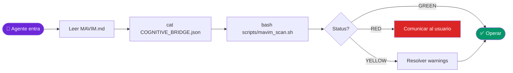

# MAVIM — Master Contract for AI Agents
> **Multi-Agent VIbe coding Methodology v3.0** — La fuente única de verdad.
> Lee este archivo completamente antes de tomar cualquier acción en este repositorio.

---

## What This Repository Is

MAVIM is a 12-SOP engineering methodology for AI agents building production software.
It is **not** an application — it is a framework of protocols, patterns, and case studies.

```
Type:     Documentation + tooling framework
Language: Markdown, Python, Bash
Audience: AI agents (any model or IDE) + human engineers
Repo:     github.com/MerariJafet/MAVIM
```

---

## Flujo de Activación



---

## Activation Sequence (Every Session)

Run in this exact order before any task:

```bash
# 1. Read this file (you are doing this now ✓)
# 2. Check Cognitive Bridge
cat COGNITIVE_BRIDGE.json 2>/dev/null || echo "No bridge — fresh session"
# 3. Environment scan
[ -f scripts/mavim_scan.sh ] && bash scripts/mavim_scan.sh 2>/dev/null || echo "No scan available — run SOP_09 manually"
# 4. Confirm your understanding
echo "MAVIM agent ready. Phase: [state current phase from Bridge]"
```

---

## Repository Structure

```
MAVIM/
├── MAVIM.md               ← You are here — read first, always (single source of truth)
├── CLAUDE.md              ← Stub that redirects here
├── COGNITIVE_BRIDGE.json  ← Session state transfer (read third)
├── core/                  ← SOPs 01–12 (the methodology)
├── patterns/              ← Architecture blueprints (LEGO blocks)
├── roles/                 ← Agent role definitions (Architect/Developer/Critic)
├── showcase/              ← Documented case studies with metrics
├── devrel/                ← Community intelligence tooling (Python)
├── prompts/               ← Meta-prompts and chain-of-thought templates
└── evals/                 ← Technical evaluation checklists
```

---

## Quick Activation — Roles & Memory

1. **Roles:** Architect diseña bloques LEGO. Developer escribe código modular. Critic audita con Checklists.
2. **Memoria:** Lee y actualiza según contexto:
   - Sprint/proyecto: `PROGRESS_LOG.json` (cada milestone completado)
   - Sesión/handoff entre IAs: `COGNITIVE_BRIDGE.json` (al iniciar y al finalizar sesión)
3. **Secreto:** Ejecuta `setup_mavim.sh` al inicio. Prohibido filtrar el `.env`.
4. **Arquitectura:** Monolito Modular, UUIDs, Ledger para dinero, H3 para mapas.
5. **Refactoring Mode:** Si el usuario pide mejorar código existente, carga `core/SOP_07_REFACTORING.md`.
   Tu prioridad #1 es la integridad del sistema. No borres código sin antes mapear sus dependencias.

---

## Secuencia para Proyecto Nuevo (SaaS desde cero)

```
1. SOP_09  → Escanear entorno (scripts/mavim_scan.sh)
2. SOP_01  → Definir INTENT_MANIFEST (problema, actores, DoD)
3. SOP_02  → Crear ARCHITECTURE_CONTRACT.md (GSD Gate + módulos + tokens UI)
4. SOP_14  → DIRECCIÓN DE ARTE (ART_DIRECTION.md — OBLIGATORIO antes de BUILD)
             ↳ Definir identidad visual, paleta, tipografía, motion system
             ↳ Activar Skills: ui-ux-pro-max + animation-libraries-expert
             ↳ Si hay 3D: activar threejs-skills
5. BUILD   → Implementar módulos (rol: MAVIM-Developer)
6. SOP_05  → Aplicar resilience patterns en servicios externos
7. SOP_06  → Mantener PROGRESS_LOG.json en cada milestone
8. SOP_08  → Correr Playwright 18 gates + A01-A07 (SOP_14) antes de commit a main
9. SOP_15  → Sensory Layer: earcons (Web Audio API) + haptic + motion cinematico
10. SENSORY CHECK → Gates S01-S08 — identidad sonora validada
11. SOP_11 → Health Check antes de cualquier deploy
12. SOP_10 → Escribir COGNITIVE_BRIDGE.json al cerrar sesión
```

> **Si ya existe código:** El punto de entrada no es SOP_01 — es SOP_09 → SOP_07 (Refactoring).

---

## Modo Quirúrgico

Cuando se trabaje sobre código existente, el `SOP_07_REFACTORING.md` es la **ley suprema**:

1. Generar `IMPACT_MAP.json` — **primer entregable obligatorio, sin excepción.**
2. Aislar en rama `refactor/[nombre]` y ejecutar Smoke Test base.
3. Operar con precisión quirúrgica: cero cambios fuera del alcance definido.
4. Validar con `INTEGRATION_SMOKE_TEST` antes de cualquier merge a `main`.

## Modo E2E — Auto-Mejora con IA

Después de cada cirugía visual, activar el **SOP_08_AUTOMATED_TESTING**:

1. `npm run test:smoke` — 18 gates Playwright en Chromium real.
2. Leer `playwright-report/mavim-trace.json` — UUID `run_id` + `failure_summary`.
3. Si hay fallos: aplicar fix quirúrgico (SOP_07), repetir desde paso 1.
4. **Sólo cuando `"failed": 0`** → commit + push.
5. El job `e2e-smoke` en CI es el árbitro final antes de merge a `main`.

> **Principio:** Si Playwright falla, la cirugía no está terminada.

## Modo Consciente — Environment Awareness

Al iniciar cualquier sesión nueva, activar el **SOP_09_ENVIRONMENT_AWARENESS**:

1. `bash scripts/mavim_scan.sh` — genera `ENVIRONMENT_SNAPSHOT.json` en < 60s.
2. Verificar `status: GREEN/YELLOW/RED` antes de operar.
3. Resolver todos los warnings antes de iniciar cirugía.
4. Si el status es RED → comunicar al usuario y esperar corrección.

> **Principio:** Un agente que no conoce su entorno opera con alucinaciones de infraestructura.

## Modo Bridge — Transición entre IAs

Al finalizar sesión o cambiar de modelo, activar el **SOP_10_COGNITIVE_BRIDGE**:

1. `python3 scripts/write_bridge.py` — genera `COGNITIVE_BRIDGE.json`.
2. El agente entrante lee el Bridge ANTES de cualquier acción.
3. Verificar `state.health` y ejecutar `handoff_instructions.first_actions`.
4. Anunciar al usuario: estado del sistema + próximo paso.

> **Principio:** El conocimiento de un agente no debe morir con su sesión.

---

## Jerarquía de SOPs (v3.1)

```
SOP_09 ENVIRONMENT_AWARENESS  ← Activar primero en sesión nueva
SOP_10 COGNITIVE_BRIDGE       ← Leer al inicio, escribir al finalizar
    ↓
SOP_07 REFACTORING            ← Ley suprema en cirugías
SOP_08 AUTOMATED_TESTING      ← Gate final (18 gates + A01-A07 + S01-S08)
    ↓
SOP_14 HIGH_FIDELITY_UI_UX    ← OBLIGATORIO antes de BUILD — Art Direction
SOP_15 SENSORY_DESIGN         ← Post-BUILD — Earcons + Motion + Haptic
    ↓
SOP_01..06                    ← Arquitectura, síntesis, evaluación, resiliencia
SOP_11 HEALTH_CHECK           ← Pre-merge, post-deploy
SOP_12 RESOURCE_OPTIMIZATION  ← Sesiones > 30 min
```

> **⚠️ ANTI-AI-SLOP LAW:** Shadcn sin personalización, paletas Tailwind default, tipografías
> system-ui, y motion ausente son violaciones explícitas de MAVIM. Ver SOP_14.

## Modo Sensorial — Identidad de Marca

Después de SOP_14 (capa visual), activar **SOP_15_SENSORY_DESIGN_BRAND_IDENTITY**:

1. Definir vocabulario sensorial del producto (tono base, timbre, volumen, motion style).
2. Implementar `useAudio.ts` hook con Web Audio API — earcons lazy, sin autoplay.
3. Sincronizar earcons con spring physics de SOP_14 (click → earcon.click en `--dur-fast`).
4. Implementar haptic feedback con guard `'vibrate' in navigator`.
5. Ejecutar **Sensory Check** (Gates S01-S08) como paso final antes de release.

> **Principio:** Un producto de lujo se distingue antes de que el usuario lea una sola palabra.

---

## Core Constraints — Non-Negotiable

### Documentation Quality
- Every new SOP must follow the exact format of existing SOPs (header, principles, protocol, checklist, references)
- SOP numbers are sequential — never reuse or skip
- The `## Checklist de Cumplimiento` section is mandatory in every SOP
- Cross-references between SOPs must use relative paths: `../core/SOP_XX_NAME.md`

### Content Integrity
- Never delete content from existing SOPs — append or create new sections
- `MAVIM.md` is the single source of truth — changes must not break the activation sequence
- `README.md` is the public manifesto — tone is technical but accessible
- Case studies in `showcase/` must include real metrics, not estimates

### Commit Discipline
- One logical change per commit
- Commit message format: `feat(scope): description` or `fix(scope): description`
- Never commit `.env` files, `.venv/`, `__pycache__/`, or `data/` directories

---

## GSD Planning Gate (Required Before New SOPs or Patterns)

Before creating any new SOP or major pattern, answer these 5 questions:

```
1. PROBLEM:    What specific failure mode does this address? (one sentence)
2. EVIDENCE:   Where has this failure been observed? (cite source/project)
3. SCOPE:      What is explicitly OUT of scope for this SOP?
4. VALIDATION: How will the agent know it applied this SOP correctly?
5. CONFLICT:   Does this conflict with any existing SOP? (check SOPs 01–12)
```

Only proceed when all 5 are answered. Document the answers in the SOP's frontmatter.

---

## UI/UX Standards (for documentation and tooling interfaces)

**Information hierarchy:**
- Lead with status (GREEN/YELLOW/RED) before detail
- Use `rich` tables for structured data, never raw print loops
- Error messages: `[source] action failed: reason — suggested fix`
- Progress: spinner for unknown duration, bar for known steps

**Report structure:**
- Executive summary first (numbers only, no prose)
- CRITICAL items before HIGH before MEDIUM
- Collapsible detail sections (`<details>` in Markdown)
- Every actionable item must have an explicit next step

**Terminal color semantics (rich):**
- `green` = success, ready, passing
- `yellow` = warning, needs attention, degraded
- `red` = failure, blocked, requires immediate action
- `blue` = informational, in-progress
- `dim` = metadata, timestamps, secondary info

---

## Agent Role Assignment

| Task | Role to assume |
|------|---------------|
| Starting a new project from scratch | MAVIM-Orchestrator (SOP_09 → SOP_01 → SOP_02 → SOP_14) |
| Implementing a defined module | MAVIM-Developer |
| Creating a new SOP | MAVIM-Architect |
| Reviewing/auditing a SOP | MAVIM-Critic |
| Writing Python tooling | MAVIM-Developer |
| Integrating external standards | MAVIM-Orchestrator |
| Responding to community questions | DevRel (use `devrel/intelligence/draft_response.py`) |
| UI/UX design, components, animations | MAVIM-Developer + Skills: `ui-ux-pro-max`, `animation-libraries-expert` |
| 3D scenes, WebGL, particles, shaders | MAVIM-Developer + Skill: `threejs-skills` |
| Aesthetic surgery on existing UI | MAVIM-Orchestrator (SOP_07 + SOP_14 + SOP_08) |

---

## Commands

```bash
# DevRel monitor (community intelligence)
cd devrel && source .venv/bin/activate
python monitor.py              # single scan
python monitor.py --watch      # continuous (every 60 min)
python monitor.py --dry-run    # no files saved, no email

# Health check (if running alongside a project)
bash scripts/health_check.sh 2>/dev/null || echo "health_check not available"
```

---

## What This Repository Does NOT Need

- Unit tests for documentation
- A web server or API
- A database or authentication layer
- Docker containers (devrel tool runs locally with venv)
- More than 12 SOPs without clear evidence of a new failure mode

---

## Escalation Protocol

If you encounter ambiguity about what to build:

1. Read `COGNITIVE_BRIDGE.json` — the answer is likely in `pending_tasks`
2. Read the relevant SOP — the answer is likely in its checklist
3. If still unclear — ask the user ONE specific question, not multiple

Never start building something to fill ambiguity. Stop and ask.

---

## Índice de SOPs

| SOP | Nombre | Cuándo activar |
|-----|--------|---------------|
| [01](core/SOP_01_INTENTION.md) | INTENTION | Al definir un nuevo feature |
| [02](core/SOP_02_ARCHITECTURE.md) | ARCHITECTURE | Al diseñar módulos o sistemas |
| [03](core/SOP_03_SYNTHESIS.md) | SYNTHESIS | Al integrar componentes |
| [04](core/SOP_04_EVALUATION.md) | EVALUATION | Al revisar calidad del código |
| [05](core/SOP_05_RESILIENCE.md) | RESILIENCE | Al diseñar manejo de errores |
| [06](core/SOP_06_CONTINUITY.md) | CONTINUITY | Al planificar sprints |
| [07](core/SOP_07_REFACTORING.md) | **REFACTORING** | **Al modificar código existente** |
| [08](core/SOP_08_AUTOMATED_TESTING.md) | **AUTOMATED_TESTING** | **Después de toda cirugía** |
| [09](core/SOP_09_ENVIRONMENT_AWARENESS.md) | **ENVIRONMENT_AWARENESS** | **Al inicio de sesión** |
| [10](core/SOP_10_COGNITIVE_BRIDGE.md) | **COGNITIVE_BRIDGE** | **Al inicio y fin de sesión** |
| [11](core/SOP_11_HEALTH_CHECK.md) | HEALTH_CHECK | Antes de merge, después de deploy |
| [12](core/SOP_12_RESOURCE_OPTIMIZATION.md) | RESOURCE_OPTIMIZATION | Sesiones > 30 minutos |
| [14](core/SOP_14_HIGH_FIDELITY_UI_UX_MOTION.md) | **HIGH_FIDELITY_UI_UX** | **ANTES de BUILD — Dirección de Arte** |
| [15](core/SOP_15_SENSORY_DESIGN_BRAND_IDENTITY.md) | **SENSORY_DESIGN** | **Post-BUILD — Earcons + Motion + Haptic** |

---

## Casos de Éxito

| Proyecto | Resultado clave |
|----------|----------------|
| [It's Me — Fases 14–16](showcase/itsme-phase14-16/CASE_STUDY.md) | 18/18 Playwright, bug crítico auto-detectado en < 2 min sin intervención humana |
