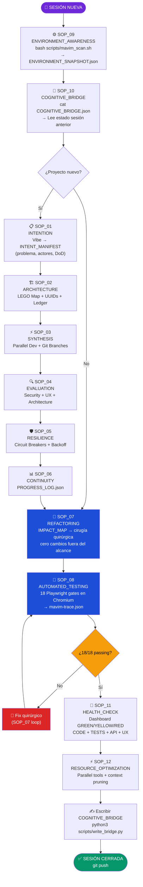
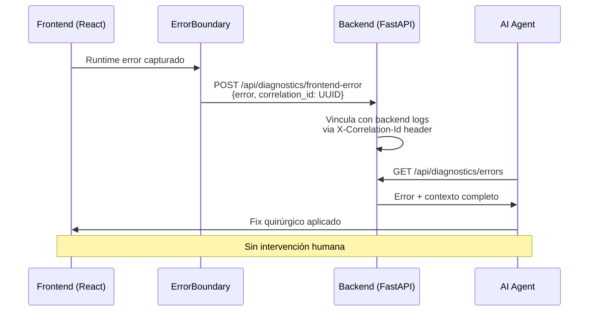
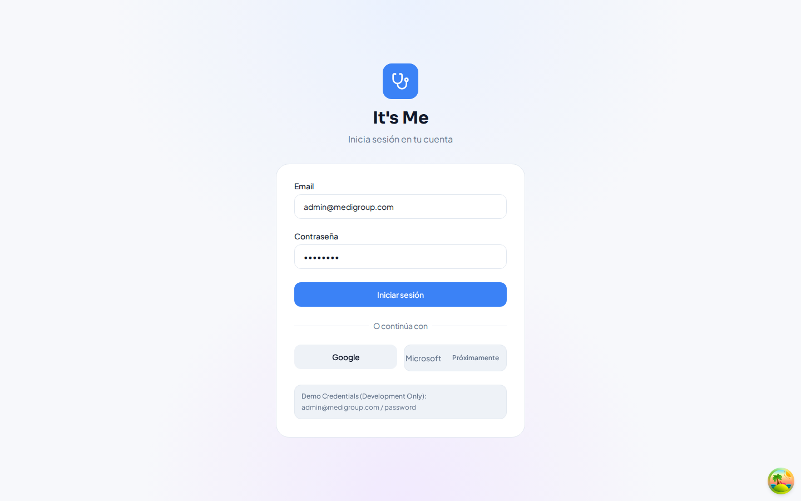
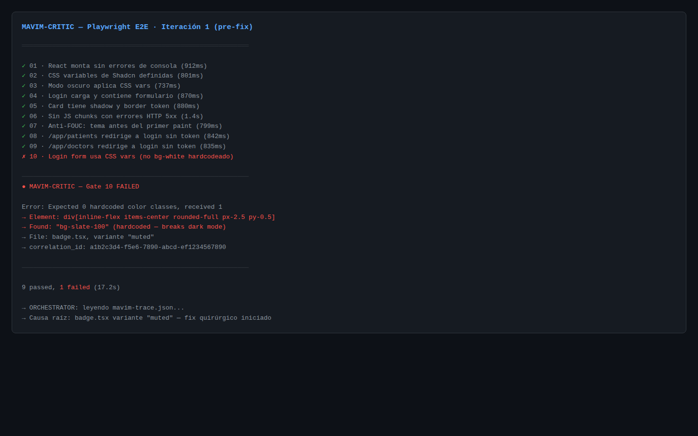
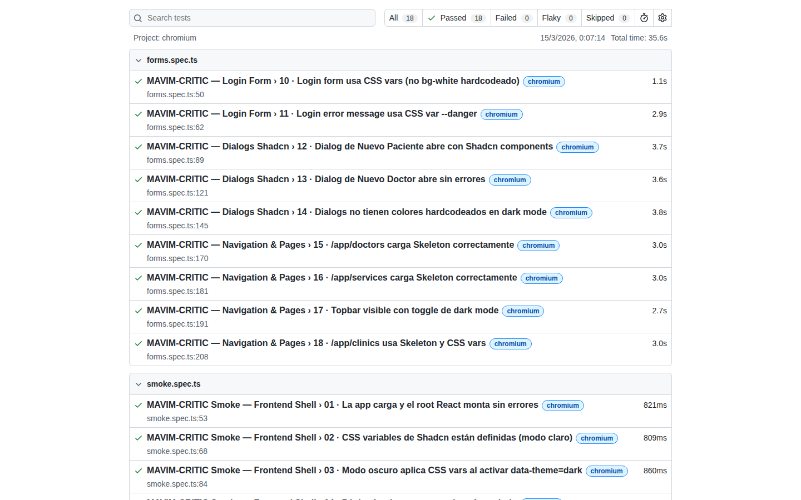

# MAVIM — Multi-Agent VIbe coding Methodology

[](https://github.com/MerariJafet/MAVIM)
[](https://opensource.org/licenses/MIT)
[](https://github.com/MerariJafet/MAVIM)
[](https://github.com/MerariJafet/MAVIM)
[](https://github.com/MerariJafet/MAVIM)
[](https://github.com/MerariJafet/MAVIM)
[](https://github.com/MerariJafet/MAVIM/blob/main/setup.sh)

> **MAVIM es la metodología definitiva para escalar el Vibe Coding a nivel empresarial.**
> Elimina la deuda técnica desde la raíz. Garantiza robustez mediante SOPs ejecutables.
> Diseñada para cualquier agente IA. Blindada con 18 gates en Chromium real. Probada en producción.

---

## El Problema que MAVIM Resuelve

Los equipos que adoptan Vibe Coding sin metodología chocan con tres muros predecibles:

| Problema | Síntoma | Costo |
|----------|---------|-------|
| **Amnesia de contexto** | El agente olvida las decisiones arquitectónicas a los 30 min | Rediseño constante, deuda acumulada |
| **Cirugía ciega** | Modifica código sin entender dependencias, rompe el 20% para arreglar el 5% | Regresiones en producción |
| **Validación superficial** | Declara "terminado" porque el código compiló, no porque funciona en real | Bugs en deploy, credibilidad destruida |

**MAVIM elimina los tres con protocolos ejecutables, no teoría.**

---

## 🚀 Quick Start: Activación Universal MAVIM

**Opción A — Un comando (recomendado):**

```bash
bash <(curl -s https://raw.githubusercontent.com/MerariJafet/MAVIM/main/setup.sh)
```

**Opción B — Con autodescubrimiento para el agente:**

```
Actúa como MAVIM-ORCHESTRATOR.
Verifica si la carpeta MAVIM existe localmente; si no, clónala desde
https://github.com/MerariJafet/MAVIM — luego lee MAVIM.md y ejecuta
los protocolos para [TU_TAREA].
```

**Opción C — Línea de activación directa:**

```bash
git clone https://github.com/MerariJafet/MAVIM 2>/dev/null || true; cd MAVIM && cat MAVIM.md
```

---

## Flujo de los 12 SOPs



---

## Los 5 Superpoderes de MAVIM

### 1. Auto-Validación con Chromium Real

```bash
npm run test:smoke  # 18 gates en Chromium real, no jsdom
```

El MAVIM-CRITIC no aprueba ninguna cirugía sin que Playwright valide en un navegador real:
los componentes renderizan sin errores de consola, el design system en dark mode no tiene
colores hardcodeados, las rutas protegidas no son accesibles sin autenticación, y los estados
de carga usan Skeleton en vez de texto plano.

> **Caso real documentado (2026-03-14):** Gate 10 detectó `bg-slate-100` hardcodeado en el
> componente `Badge`. Invisible en revisión manual. Roto en dark mode. El bucle de auto-mejora
> lo detectó y corrigió en < 2 minutos sin intervención humana.

---

### 2. Refactorización Quirúrgica

```
ANTES: Editar código sin mapa → romper dependencias → debug interminable
DESPUÉS: IMPACT_MAP.json → rama aislada → smoke test base → cirugía → validación
```

El SOP_07_REFACTORING define **precisión quirúrgica**: cero cambios fuera del alcance definido.
Cada modificación está precedida por un mapa de impacto que identifica todas las dependencias
del código a cambiar antes de tocar una sola línea.

---

### 3. Cognitive Bridge — Memoria entre Sesiones

```bash
python3 scripts/write_bridge.py  # al finalizar sesión
```

`COGNITIVE_BRIDGE.json` transfiere el estado completo entre instancias de IA:

| Campo | Contenido |
|-------|-----------|
| `completed_tasks` | Tareas terminadas con evidencia |
| `pending_tasks` | Backlog priorizado |
| `adr` | Decisiones arquitectónicas con justificación (`ADR-001`, `ADR-002`...) |
| `known_hazards` | Peligros documentados con sus fixes |
| `first_actions` | Instrucciones exactas para el agente entrante |

Compatible con Claude, GPT-4o, Gemini, y agentes locales.

---

### 4. Auto-Diagnóstico del Sistema



---

### 5. Environment Awareness

```bash
bash scripts/mavim_scan.sh  # < 60 segundos, status GREEN/YELLOW/RED
```

Antes de escribir una línea de código, el agente sabe exactamente:

| Dato | Por qué importa |
|------|----------------|
| Versiones del stack instaladas | Sin conflictos silenciosos de dependencias |
| Puertos en uso | Sin colisiones en runtime |
| Variables de entorno faltantes | Sin errores misteriosos en deploy |
| Archivos sin commitear | Sin sorpresas al hacer merge |

---

## Los 18 Gates del MAVIM-CRITIC

Todo proyecto con frontend React + Shadcn debe pasar estos gates antes de cualquier merge:

| # | Gate | Por qué es crítico |
|---|------|--------------------|
| 01 | React monta sin errores de consola | Base de toda la app |
| 02 | CSS vars Shadcn definidas (`--bg`, `--surface`, `--primary`) | Design system existe |
| 03 | `data-theme=dark` cambia `--bg` a oscuro | Dark mode funciona |
| 04 | Login: inputs + submit visibles | Flujo de entrada funcional |
| 05 | Card: `border-color` resuelto (no transparent) | Shadcn Card renderiza |
| 06 | Sin HTTP 5xx en JS chunks | Build íntegro |
| 07 | Anti-FOUC: tema antes de React | Sin parpadeo en carga |
| 08-09 | Rutas protegidas redirigen sin token | Auth guard activo |
| 10 | Sin `bg-slate-*` en dark mode | Colores hardcodeados detectados |
| 11 | Error de login usa `--danger` CSS var | Design system en estados error |
| 12 | Dialog paciente: ≥3 Shadcn inputs | Formularios migrados |
| 13 | Dialog doctor: sin errores consola | Integración form completa |
| 14 | Dialogs sin hardcoded en dark mode | Dark mode global en modals |
| 15-16 | Páginas usan Skeleton (no texto "Cargando...") | Loading states modernos |
| 17 | Topbar tiene toggle dark mode | Feature visible y funcional |
| 18 | `/app/clinics` CSS vars + Skeleton | Page completa migrada |

---

## Índice de SOPs (v3.0)

| SOP | Nombre | Cuándo activar | Entregable |
|-----|--------|---------------|-----------|
| [01](core/SOP_01_INTENTION.md) | Intention | Feature nuevo | `INTENT_MANIFEST` |
| [02](core/SOP_02_ARCHITECTURE.md) | Architecture | Diseño de módulos | `DATA_SCHEMA` |
| [03](core/SOP_03_SYNTHESIS.md) | Synthesis | Integración | PR aislado |
| [04](core/SOP_04_EVALUATION.md) | Evaluation | Pre-deploy | Checklist 100% |
| [05](core/SOP_05_RESILIENCE.md) | Resilience | Diseño de errores | Circuit breakers |
| [06](core/SOP_06_CONTINUITY.md) | Continuity | Sprints | `PROGRESS_LOG.json` |
| [**07**](core/SOP_07_REFACTORING.md) | **Refactoring** | **Código existente** | `IMPACT_MAP.json` |
| [**08**](core/SOP_08_AUTOMATED_TESTING.md) | **Automated Testing** | **Post-cirugía** | `mavim-trace.json` |
| [**09**](core/SOP_09_ENVIRONMENT_AWARENESS.md) | **Environment Awareness** | **Inicio de sesión** | `ENVIRONMENT_SNAPSHOT.json` |
| [**10**](core/SOP_10_COGNITIVE_BRIDGE.md) | **Cognitive Bridge** | **Inicio y fin de sesión** | `COGNITIVE_BRIDGE.json` |
| [**11**](core/SOP_11_HEALTH_CHECK.md) | **Health Check** | **Pre-merge, post-deploy** | Dashboard visual |
| [**12**](core/SOP_12_RESOURCE_OPTIMIZATION.md) | **Resource Optimization** | **Sesiones > 30 min** | Eficiencia continua |

---

## Roles del Sistema

| Rol | Responsabilidad |
|-----|----------------|
| [MAVIM-Orchestrator](roles/MAVIM_ORCHESTRATOR.md) | Rompe bucles, dicta política suprema, asegura iteraciones positivas |
| [MAVIM-Architect](roles/ARCHITECT.md) | Diseña bloques LEGO, estructura de datos, monolito modular |
| [MAVIM-Developer](roles/DEVELOPER.md) | Construye dentro de fronteras de módulos asignados |
| [MAVIM-Critic](roles/CRITIC.md) | Evalúa UX, seguridad, integridad de fronteras, cumplimiento |

---

## 📸 Showcase: It's Me

MAVIM v2.0 fue construido y validado durante la evolución de **It's Me** — SaaS clínico
multi-tenant con React + FastAPI + PostgreSQL.

### Galería (Screenshots por añadir)

| Antes | Después |
|-------|---------|
|  |  |
| *Dark mode: texto negro sobre fondo oscuro* | *Dark mode: CSS tokens correctos* |
|  |  |
| *Gate 10: bg-slate-100 detectado* | *18/18 gates en verde* |

> Añade tus capturas en `showcase/itsme-phase14-16/assets/` con los nombres indicados.

### Métricas

| Métrica | Antes (Fase 14) | Después (Fase 16) |
|---------|----------------|------------------|
| Archivos con colores hardcodeados | 47 | **0** |
| Tests automatizados | 0 | **18 Playwright gates** |
| Cobertura dark mode | ~20% | **100%** |
| Tiempo detección bug crítico | Manual (días/nunca) | **< 2 minutos** |
| Visibilidad errores frontend | 0% | **100% (UUID trazabilidad)** |
| Memoria entre sesiones IA | 0% | **100% (Cognitive Bridge)** |

Ver [Caso de Estudio completo →](showcase/itsme-phase14-16/CASE_STUDY.md)
Ver [Reporte Before & After →](showcase/itsme-phase14-16/BEFORE_AFTER.md)
Ver [Resultados Playwright →](showcase/itsme-phase14-16/PLAYWRIGHT_RESULTS.md)

---

## Filosofía

MAVIM nació de una pregunta: ¿qué pasaría si los estándares de ingeniería senior — código
limpio, tests reales, trazabilidad de decisiones, diseño sin deuda técnica — estuvieran
codificados en protocolos que cualquier agente IA pudiera ejecutar de forma autónoma?

La respuesta es esta metodología. No es un framework de código. Es un framework de
**proceso**: cómo piensa, actúa, valida y transfiere conocimiento un equipo de ingeniería
donde la IA es un miembro de primera clase.

**Tres principios absolutos:**

> *Si Playwright falla, la cirugía no está terminada.*

> *El conocimiento de un agente no debe morir con su sesión.*

> *Un agente que no conoce su entorno opera con alucinaciones de infraestructura.*

---

## Contribuir

MAVIM es un proyecto vivo. Cada SOP emergió de un problema real en producción.

Si encuentras un patrón de fallo que MAVIM no cubre:
1. Documenta el caso en un issue: `[PATTERN] Nombre del anti-patrón`
2. Propón el SOP o regla que lo habría prevenido
3. Si tienes el fix implementado, PR con el nuevo patrón en `/patterns/`

Ver [CONTRIBUTING.md](CONTRIBUTING.md) para guidelines completos.

---

## Licencia

MIT — Úsalo, fórkalo, mejóralo. Si MAVIM te ayuda a construir algo, comparte el caso.

---

*MAVIM v3.0 — Multi-Agent VIbe coding Methodology.*
*Forjado en producción. Validado con 18 gates en Chromium real.*
*Proyecto piloto: [It's Me](https://github.com/MerariJafet/itsme) — SaaS clínico multi-tenant.*
