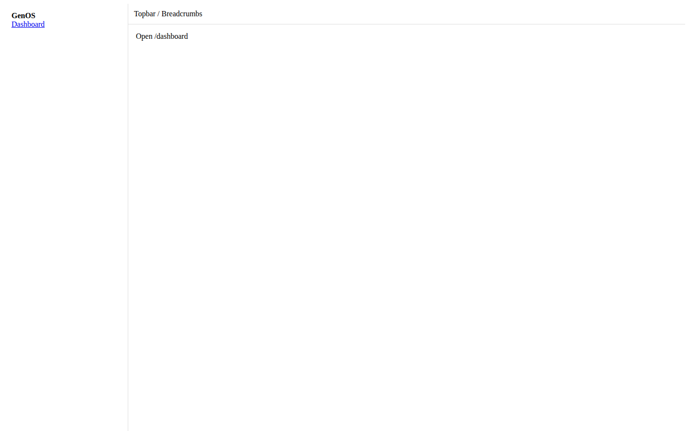

# Caso: GPS — Visualizador de Repositorios 3D
## Proyecto en observación MAVIM | 2026-03-15

---

## Stack

| Capa | Tecnología |
|------|-----------|
| Frontend | Next.js 15 + TypeScript + Tailwind CSS |
| Backend | FastAPI (Python) |
| Visualización | react-force-graph-3d + Three.js |
| Puerto frontend | :3001 |
| Puerto backend | :8001 |

---

## Estado Actual (Capturado con Playwright)

> Screenshots capturados automáticamente en Chromium 1440×900
> contra `http://localhost:3001` (servicio activo)

### Estado inicial — Sin proyecto cargado


### Estado renderizado (3D graph)



*Nota: el grafo 3D requiere cargar un repositorio local. WebGL renderiza
correctamente en browser; en modo headless muestra el estado de espera.*

---

## Diseño Actual

GPS usa un sistema de diseño **custom cyberpunk/neon** intencional:

```css
:root {
  --bg-deep:       #050510;         /* fondo ultra-oscuro */
  --neon-cyan:     #00F0FF;         /* acento primario */
  --neon-violet:   #BD00FF;         /* acento secundario */
  --neon-magenta:  #FF0055;         /* acento terciario */
  --matrix-green:  #00FF41;         /* estado activo */
  --text-primary:  #E0E6ED;
}
```

Esta paleta es **by design** para el dominio de visualización de grafos de código.
Una migración a Shadcn requeriría definición explícita de alcance antes de ejecutar.

---

## Próximos Pasos (Propuesta MAVIM)

Para aplicar SOP_07 + SOP_11 a GPS, el IMPACT_MAP debería definir:

| Componente | Estado actual | Propuesta |
|------------|--------------|-----------|
| `TopBar.tsx` | Custom neon | Shadcn Menubar + tokens neon |
| `SidebarLeft.tsx` | Custom dark | Shadcn Sheet + glassmorphism |
| `SidebarRight.tsx` | Custom | Shadcn ScrollArea + tokens |
| `StatCard.tsx` | Custom card | Shadcn Card con tokens neon |
| `RepoLoader.tsx` | Custom input | Shadcn Input + neon focus ring |
| `HealthGauge.tsx` | SVG custom | Mantener (componente especializado) |
| `GraphViz.tsx` | Three.js | Mantener (3D — fuera de alcance Shadcn) |

**Acción requerida:** Aprobación del propietario sobre alcance antes de cirugía.

---

*Capturado por MAVIM-ORCHESTRATOR — 2026-03-15*
*github.com/MerariJafet/MAVIM*
